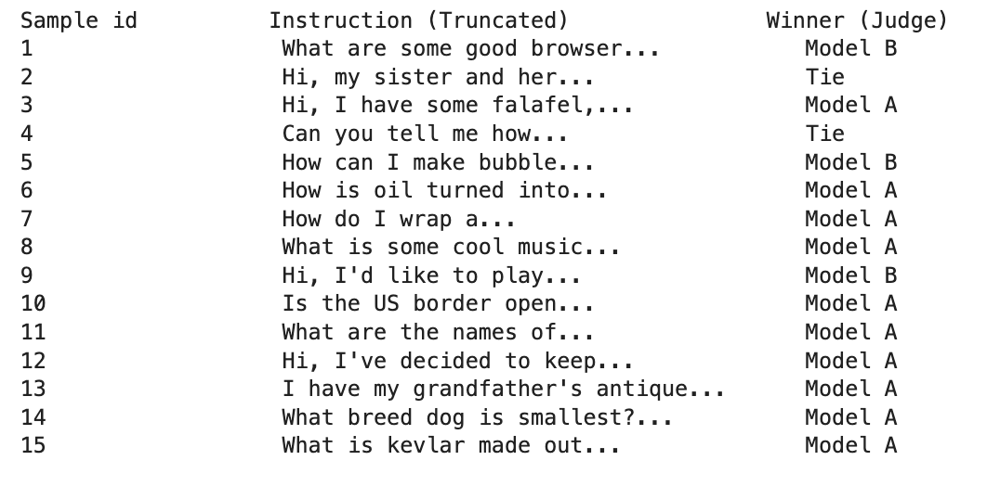

# OPT-1.3B Fine-Tuning with SFT + DPO
A complete pipeline for fine-tuning Meta's `facebook/opt-1.3b` language model using **Supervised Fine-Tuning (SFT)** followed by **Direct Preference Optimization (DPO)** — the standard two-stage alignment approach used in modern LLM training.

The fine-tuned model is available on Hugging Face Hub: [Imtiaz1256/opt-1.3b-dpo-finetuned](https://huggingface.co/Imtiaz1256/opt-1.3b-dpo-finetuned)

## 📋 Table of Contents

- [Overview](#Overview)
- [Pipeline](#pipeline)
- [Requirements and Installation](#RequirementsandInstallation)
- [Usage](#usage)
- [Results](#results)
- [Limitations](#limitations)
- [Future Improvements](#future-improvements)
- [References](#references)
---
## Overview

This project implements a two-stage RLHF-style alignment pipeline:

1. **SFT (Supervised Fine-Tuning)** — fine-tunes the base model on high-quality instruction-response pairs using the `chosen` responses from a preference dataset
2. **DPO (Direct Preference Optimization)** — further aligns the SFT model using human preference pairs (`chosen` vs `rejected`), without requiring a separate reward model

Both stages use **LoRA (Low-Rank Adaptation)** with **8-bit quantization** to enable training on consumer-grade GPUs with limited VRAM.
---
## Pipeline

```
facebook/opt-1.3b (base)
        │
        ▼
┌───────────────────┐
│  Stage 1: SFT     │  Train on prompt + chosen response
│  LoRA (r=16)      │  Alpaca instruction format
│  8-bit quant      │
└───────────────────┘
        │
        ▼
  SFT Checkpoint
        │
        ▼
┌───────────────────┐
│  Stage 2: DPO     │  Learn to prefer chosen over rejected
│  LoRA (r=16)      │  KL penalty β=0.1
│  8-bit quant      │
└───────────────────┘
        │
        ▼
  DPO Checkpoint → Hugging Face Hub
```
---
## Requirements and Installation
```bash
pip install -r requirements.txt
```
---
## Load fine-tuned model from Hub

```python
from peft import PeftModel
from transformers import AutoModelForCausalLM, AutoTokenizer

base = AutoModelForCausalLM.from_pretrained("facebook/opt-1.3b")
model = PeftModel.from_pretrained(base, "Imtiaz1256/opt-1.3b-dpo-finetuned")
tokenizer = AutoTokenizer.from_pretrained("Imtiaz1256/opt-1.3b-dpo-finetuned")
```
---

## Results

### SFT Training Loss

The SFT model showed strong and consistent convergence over ~320 steps, with loss dropping from **2.57 → ~1.80**, indicating the model successfully learned the instruction-following format.

</img>

### DPO Training Loss

The DPO stage converged over ~250 steps, with loss dropping from **0.69 → ~0.27**. The lower absolute loss values are expected in DPO as it optimises a preference ratio rather than a raw language modelling objective.

</img>

### Judge Evaluation (Win Rate)

A Mistral-7B-Instruct judge model evaluated responses from the base model (Model A) vs the DPO fine-tuned model (Model B) across 15 sample prompts:

</img>

| Metric | Value |
|---|---|
| Model A (Base) wins | 10 / 15 |
| Model B (DPO) wins | 3 / 15 |
| Ties | 2 / 15 |
| **DPO Win Rate** | **0.27%** |

<!-- </img><br> -->
The low win rate of the DPO model against the base `facebook/opt-1.3b` is expected given the constraints described below.

---

## Limitations

- **Small base model** — OPT-1.3B has limited capacity compared to 7B+ models. Its instruction-following ability is inherently constrained regardless of fine-tuning.
- **8-bit quantization** — while necessary for VRAM constraints, quantization reduces model precision and can hurt fine-tuning quality compared to full-precision training.
- **Small dataset** — only 1,016 training examples were used for both SFT and DPO, which is insufficient for robust alignment.
- **Short sequences** — `max_length=256` truncates many examples, losing important context.
- **Limited epochs** — 5 epochs for SFT and 4 for DPO on a small dataset may not be enough for full convergence.
- **Judge model bias** — using Mistral-7B-Instruct as a judge introduces its own biases and may not perfectly reflect human preferences.
- **LoRA only trains a subset of parameters** — ~0.06% of total parameters, limiting how much the model can change.

---

## Future Improvements

- **Larger base model** — use LLaMA-2-7B or Mistral-7B as the base for significantly better results
- **More data** — scale to 10k–100k preference pairs (e.g. Anthropic HH-RLHF, OpenAssistant)
- **4-bit QLoRA** — use `load_in_4bit=True` with `bnb_4bit_quant_type="nf4"` for better memory efficiency, allowing larger batch sizes or longer sequences
- **Larger LoRA rank** — increase `r` from 16 to 64 or use full fine-tuning if VRAM allows
- **PPO alternative** — compare DPO against PPO-based RLHF to evaluate which alignment method works better for this model size
- **Better evaluation** — use multiple judge models or human evaluation instead of a single LLM judge
- **Longer sequences** — increase `max_length` to 512 or 1024 with a larger GPU to avoid truncation

---
## References
1.https://huggingface.co/datasets/jondurbin/truthy-dpo-v0.1 <br>
2.https://huggingface.co/docs/trl/main/dpo_trainer <br>
3.https://huggingface.co/datasets/tatsu-lab/alpaca_eval <br>
4.https://huggingface.co/datasets/tatsu-lab/alpaca_eval/resolve/main/alpaca_eval.json
